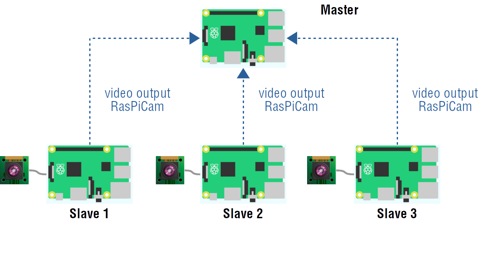
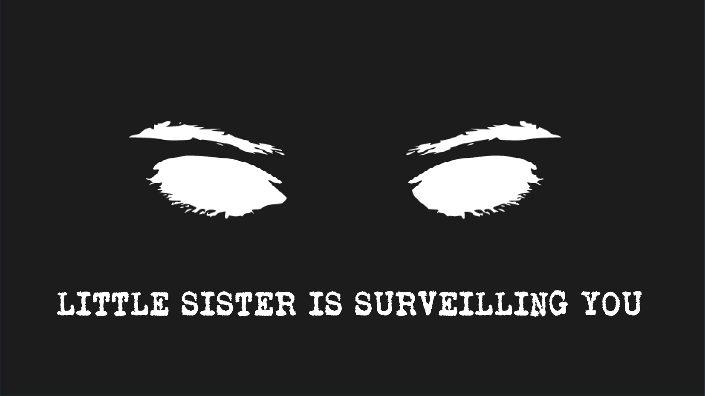

# LittleSister

LittleSister is a Python script suite that establishes a modular and customizable video streaming surveillance system.

The software also employs a picture difference calculation and (simple) delta encoding to not send entire pictures all the time, but only differences between frames.
This saves bandwidth.

## How to Install LittleSister

Firstly, **this program only works with Raspberry Pi Camera Modules**.

You need to establish a network connection between two or more Raspberry Pis before installing LittleSister.

One Pi has to be designated as the "master". This master will contain the Python scripts located in the "src/master" folder.

The other Pis will be "slaves". They will contain the Python scripts located in the "src/slave" folder.

After copying the files, the result will (probably) be a star network topology in which slaves "vomit" data towards the master.

## How to set up & run LittleSister
### Master Raspberry Pi
1. Change the network settings (IP of master and UDP port) in PictureSettings.py of master source code folder, if necessary.
2. On the master Raspberry Pi, launch **LaunchMaster.py**.

### Slave Raspberry PI
1. Change the settings in PictureSettings.py of source source code folder, if necessary.
2. On a slave Raspberry Pi, launch **LaunchSlave.py**.

## Python Dependencies

LittleSister has the following Python dependencies:

* imghdr
* io
* os
* PIL
* select
* socket
* sys
* StringIO
* time

